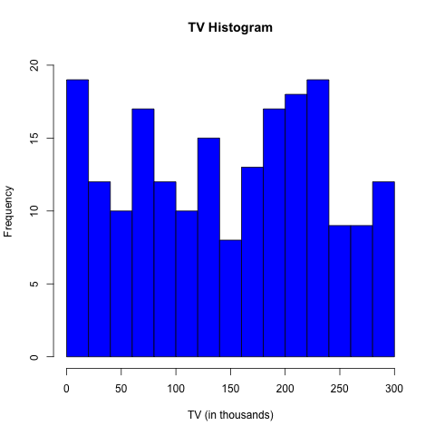
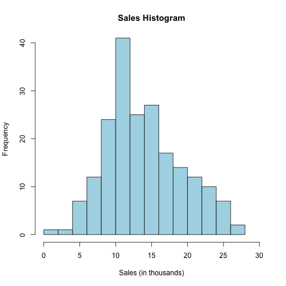

```{r setup, include=FALSE}
knitr::opts_chunk$set(echo = TRUE)
```

## Abstract

For this project I will refer to the book _An Introduction to Statistical Learning_ (by James et al).

My goal for this project was to conduct a simple analysis using the [Advertising.csv](http://www-bcf.usc.edu/~gareth/ISL/Advertising.csv) dataset to look at sales across various products as a function of advertising budget, specifically for TV media spend. 

In particular, we were answering the question: _Is there a relationship between TV advertising budget and sales?_.

Throughout this report I will conclude that there is a direct positive correlation between increased budget on TV media spend and sales.

## Introduction

In order to answer the question if there is a relationship between the TV advertising budget and sales, we need to find concrete evidence of an association between TV media spend and sales. To find this association, I will use a _simple linear regression model_, which predicts a quantitiatve response _Y_ on the basis of one predictor variable _X_. We can model this linear relationship as Y = $\beta_0$ + B1X. In particular, for this analysis looking at TV media spend versus sales, since we are trying to predict sales based off of TV media spend, our predictor variable, X, will be TV media spend, and our Y variable will be sales.

`sales` = $\beta_0$ + $\beta_1$ x `TV`

$\beta_0$ represents the _y-intercept_, which simply means that if X = 0 then what would our Y look like (i.e. if our TV media spend is $0 what would our sales be).
$\beta_1$ represents the _slope_, which is the amount by which Y increases/decreases as we change our X value. (i.e. if our TV media spend increases from $100 to $200, the change in sales would represent the slope)

_How do we know what $\beta_0$ and $\beta_1$ are?_ The answer is: we don't, and this is the goal of a linear regression model. To find the coefficient estimtaes $\beta_0$ and $\beta_1$ such that the model fits the data. Think of a scatterplot with all the possible combinations of (TV spend, sales), then the linear model will find a _line of best fit_ such that the line approximates the data as closely as it can by using a method of _minimizing the least squares_. 

## Data

The Advertising data set is 200 x 5 in dimensions. There are 200 rows, each row being a unique item and there are 5 columns:

- X: index

- TV: Advertising budget on TV (in thousands $)

- Radio: Advertising budget on radio (in thousands $)

- Newspaper: Advertising budget on newspaper (in thousands $)

- Sales: Product sales (in thousands $)

The table contains `sales` in thousands of units for a particular product as a function of advertising budgets (in thousands of dollars). In this specific analysis, we will use the `TV` and `sales` columns to look at the relationship between TV and sales.

## Methodology

My methodology for this project was to first compute some simple statistics, to get an idea of how the data was formatted and spread out. Then I created a visual representation for the TV data as well as the Sales data, to see the distribution. I then created a linear model and plotted TV versus Sales to get an idea of their correlation.

### Simple Summary

```{r results='asis', echo=FALSE}
library('stargazer')
summary_stats = read.table('../data/eda-output.txt', sep='\t')
stargazer(summary_stats, title = 'Summary Statistics for TV spend and Sales (in thousands)', type='latex', summary=FALSE, header=FALSE)
```

From this summary table, we can see that the spread of TV media spend went from 0.70 to 296.40 (in thousands), while sales spread from 1.60 to 27.00 (in thousands). This goes to show that there is greater standard deviation in TV media spend than in sales. The mean of TV fell at 147.04 with the median being 149.75, and the mean of Sales fell at 14.02, with the median at 12.90, which leads us to believe that they are similar in distribution. Let's look at this graphically to confirm this.

### Histograms

I wanted to take a quick look at the data, to see how it is distributed. To do this I created histograms of the data to look at their frequency distribution.

```{r, out.width = "200px", echo=FALSE}

```

From the histogram of TV we can see that it is indeed _not_ normally distributed, and actually varies quite a lot

```{r, out.width = "200px", echo=FALSE}

```

The histogram of sales actually shows that it has more of a normal distrubtion than the TV distribution, but tails more to the right whereas it drops quite steep on the left side, which a giant spike in the 10-13 range.

### Scatterplot and linear model

```{r results='asis', echo=FALSE}
load('../data/regression.RData')
library('stargazer')
stargazer(reg_summary$coefficients, title = 'Linear Regression TV versus Sales', type='latex', header=FALSE)
```

```{r, out.width = "200px", echo=FALSE}

```

This scatterplot represents the least squares fit for the regression of `sales` onto `TV`. Each blue point represents a pair (`TV`, `sales`), and the yellow line represents the linear model that fits the data. For each value of TV spend, we can now predict the sales if we were to spend that much on TV.

Diving deeper into the analysis, we can conclude that our y-intercept is 7.03259 and our slope is 0.04754.

Our formula for TV versus Sales is now:

`sales` = 7.03259 + 0.04754 x `TV`

More generally, this means that there is a +0.04754 correlation between an increase in TV spend and sales.

## Results

The results show a direct positive correlation between TV media spend and sales. The result of this simple linear regression model would lead one to encourage the increase of TV media spend to improve sales. However, this comes with a few stipulations that you would want to check before jumping to increase your TV budget. For example, we would want to look at the correlations between radio and newspaper media spend as well to see if there might be a stronger correlation. If so, we would want to invest in those areas before investing more in TV. Another iteration on this linear model would be a more complex model. As you can see in the scatterplot, as TV spend increases, the distance between the points and the residual line increase, in both directions. This leads me to believe that there is some other factor involved as TV spend increases that either significantly increases, or decreases the impact of sales.

## Conslusions

While the goal of this analysis was to find a relation between TV media spend and sales, the real purpose of this project was to determine the reproducibility of the analysis in James' _An Introduction to Statistical Learning_. Since our results are the same as his, we can conclude that his findings are indeed reproducible.
