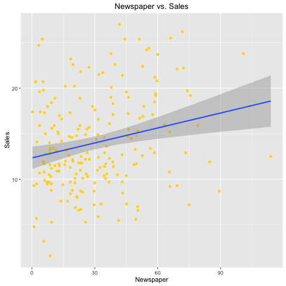

```{r setup, include=FALSE}
knitr::opts_chunk$set(echo = TRUE)
library(stargazer)
load('../data/regression.RData')
load('../data/correlation-matrix.RData')
source("../code/functions/regression-functions.R")
```

## Abstract

For this project I will refer to the book _An Introduction to Statistical Learning_ (by James et al).

My goal for this project was to conduct a multiple regression analysis using the [Advertising.csv](http://www-bcf.usc.edu/~gareth/ISL/Advertising.csv) dataset to look at sales across various products as a function of advertising budget, specifically referring to Newspaper, Radio and TV media spend. 

In particular, we were answering the questions: 

1. Is at least one of the predicotrs useful in predicting the response?

2. Do all predictors help to explain the response, or is only a subset of the predictors useful?

3. How well does the model fit the data?

4. How accurate is the prediction?

## Introduction

In order to answer the questions regarding predictors and the response, we need to not only look at the specific relations between said predictors and the response, but also at the interaction between the predictors and the response. To analyze this interaction, I will use a _multivariate linear regression model_, which predicts a quantitative repsonse _Y_ on the basis of multiple predictor variables _X1_, _X2_, _X3_, etc.

For this analysis looking at Newspaper, Radio and TV media spend versus sales, our predictor varialbes will be Newspaper, Radio and TV media spend, and our Y varialbe will be sales.

`sales` = $\beta_0$ + $\beta_1$ x `newspaper` + $\beta_2$ x `radio` + $\beta_3$ x `TV`

## Data

The Advertising data set is 200 x 5 in dimensions. There are 200 rows, each row being a unique item and there are 5 columns:

- `X`: index

- `newspaper`: Advertising budget on newspaper (in thousands $)

- `radio`: Advertising budget on radio (in thousands $)

- `TV`: Advertising budget on TV (in thousands $)

- `sales`: Product sales (in thousands $)

The table contains `sales` in thousands of units for a particular product as a function of advertising budgets (in thousands of dollars).

## Methodology

### Coefficient estimates of simple regression models

First, I looked at each media source and it's individual relationship with sales.

#### Newspaper

```{r results='asis', echo=FALSE}
stargazer(reg_summary_Newspaper$coefficients, title = 'Simple regression of sales on newspaper', type='latex', header=FALSE)
```

```{r, out.width = "200px", echo=FALSE, fig.align="center"}

```

Equation for `sales` ~ `newspaper`:

`sales` = 12.351 + 0.055 x `newspaper`

The graph as well as the coefficient of 0.055 indicates a positive correlation between sales and newspaper media spend. From the scatterplot we can tell that there is a higher density of points towards the left of the graph, with few points past 90 and a much higher standard deviation as newspaper media spend increases. Relative to the other predictors, we will soon see that newspaper has a higher standard error than radio and TV. Also note that the y-intercept is 3 points above any of the other predictors, which means that for $0 newspaper media spend, we're still seeing $12,351 in sales being reported.

#### Radio

```{r results='asis', echo=FALSE}
stargazer(reg_summary_Radio$coefficients, title = 'Simple regression of sales on radio', type='latex', header=FALSE)
```

```{r, out.width = "200px", echo=FALSE, fig.align="center"}

```

Equation for `sales` ~ `radio`:

`sales` = 9.312 + 0.202 x `radio`

The correlation coefficient is highest for radio at 0.202 in relation to the other predictors, with a low standard error, indicating a strong correlation between sales and radio media spend. 

#### TV

```{r results='asis', echo=FALSE}
stargazer(reg_summary_TV$coefficients, title = 'Simple regression of sales on TV', type='latex', header=FALSE)
```

```{r, out.width = "200px", echo=FALSE, fig.align="center"}
knitr::include_graphics("../images/scatterplot-TV-sales.png")
```

Equation for `sales` ~ `TV`

`sales` = 7.033 + 0.048 x `TV`

The linear model for TV has the lowest standard error amonst each of the predictors, as well as the lowest y-intercept, indicating that although it's correlation coefficient isn't the highest, that it might have a stronger effect on sales than if we just looked at the coefficients individually. We will be investigating this in the rest of the report.

### Coefficient estimates of the least squares model

```{r results='asis', echo=FALSE}
stargazer(reg_summary_multi$coefficients, title = 'Coefficient estimates', type='latex', header=FALSE)
```

This table shows the least squares coefficient estimates of the multiple linear regression of number of units sold on radio, TV, and newspaper media spend. How we should interpret this is that the coefficients for each of these represent the average effect of increasing that particular predictor, while holding all other predictors constant; e.g. the coefficient for `TV` is the average effect of increasing TV media spend by $1,000 while holding `newspaper` and `radio` fixed.

What we note here is that the coefficient for `newspaper` is significantly close to zero, and actually has a negative effect on sales when compared against the other predictors 

The main takeaway from this table should be that the coefficients can vary when you're looking at single versus multiple linear regressions, and that when dealing with multiple variables, a multi regression should be taken into account.

### Correlation matrix

```{r results='asis', echo=FALSE}
stargazer(correlation_matrix, title = 'Correlation matrix', type='latex', header=FALSE)
```

In this correlation matrix table we can clearly tell that `TV` has the strongest correlation with `sales` (0.782) while `radio` (0.576) and `newspaper` (0.228) are weaker. We can also note the fact that there is a trend for an increased newspaper media spend where more is spent on radio media. The bottom line is that, if we were to look at simple linear regressions alone, we would not have noticed such a weak relationship between newspaper media spend on sales.

These relations are represented visually in the scatterplot matrix graph below. The pink scatterplots represent those with the highest correlations - namely `TV` ~ `sales` and `radio` ~ `sales`, whereas the relationship between `newspaper` and `sales` is represented as blue, indicating a very weak correlation.

```{r, out.width = "200px", echo=FALSE, fig.align="center"}

```

```{r, echo=FALSE}
advertising_full <- read.table('../data/Advertising.csv', header=TRUE, sep=',')
advertising <- advertising_full[c('TV', 'Sales', 'Radio', 'Newspaper')]
reg <- lm(Sales ~ TV + Newspaper + Radio, data=advertising)
```

### Residual Sum of Squares

The residual sum of squares measures the amount of variability that is left unexplained after performing the regression. To calculate this, you sum up the residual coefficients and predictor coefficients, square each of these sums then add them all together.

```{r}
residual_sum_squares(reg)
```

### $R^2$

The $R^2$ statistic takes the form of a _proportion_-the proportion of variance explained as a value between 0 and 1, which is independent of the scale of Y. Essentially it measures the _proportion of variability in Y that can be explained using X_. A higher number indicates that a higher proportion of the variability can be explained by the regression. In this case with a $R^2$ > 0.8, we can assume that the regression does a fairly accurate job of fitting the data.

_$R^2$_ = 1 - RSS/TSS

```{r}
r_squared(reg)
```

### F-statistic

If there is no relationship between the predictors and the response, then the F-statistic would take a value closer to 1. Since we have a very large F-statistic of over 500, we can assume that at least one of the predictors is related to our response; in other words at least one of `TV`, `radio`, or `newspaper` is related to `sales` (which we already knew).

_F-statistic_ = (TSS - RSS)/_p_ / RSS/(_n_ - _p_ - 1)

```{r}
f_statistic(reg)
```

We can see all of these results organized in the table below.

```{r results='asis', echo=FALSE}
stargazer(reg)
```

## Results

## Conslusions
